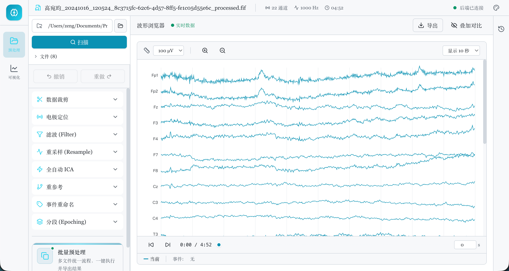
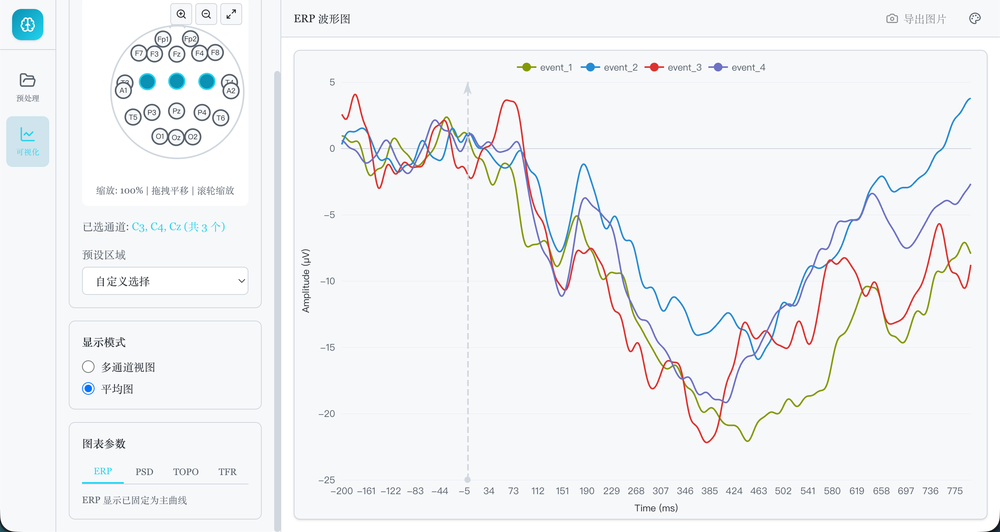
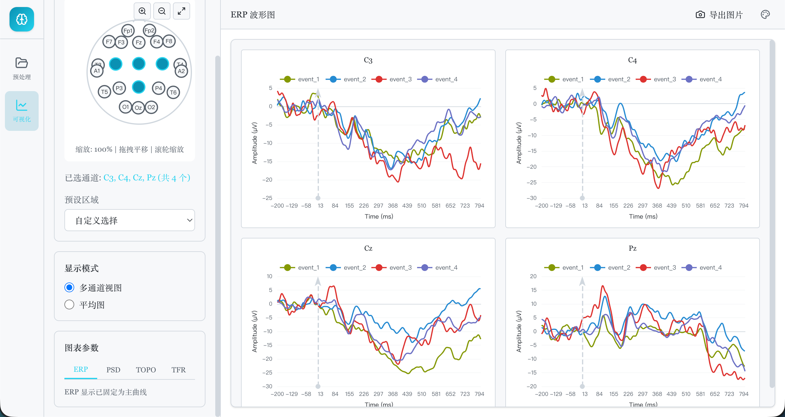
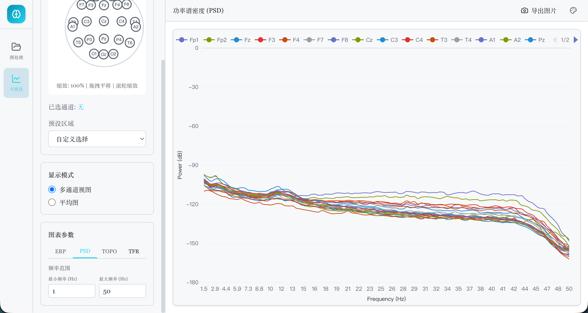
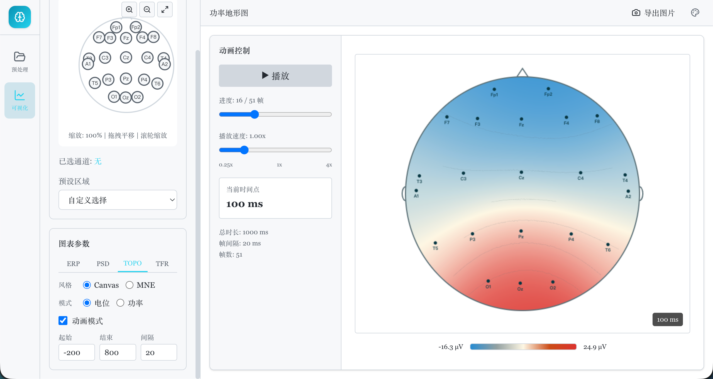

<div align="center">
  
  <h1>EEGAnalysis Pro (EEGPlatform)</h1>
  <p>本地化脑电数据预处理与可视化分析平台</p>
</div>

## 项目简介

EEGAnalysis Pro 是一个面向脑电（EEG）数据处理流程的桌面化/本地化分析平台，采用前后端分离架构：

- 前端：`React + Vite + TypeScript`，提供预处理、波形浏览、可视化与主题化 UI。
- 后端：`FastAPI + MNE`，提供数据加载、预处理算法、ERP/PSD/地形图/TFR 等计算接口。

## 功能特性

- 工作区扫描与 EEG 文件加载（`edf/set/fif`）
- 预处理流程：滤波、重采样、ICA、分段（Epoching）等
- 波形浏览：通道显示、事件标记、时间窗控制、导出
- 可视化分析：ERP、PSD、地形图、时频图（TFR）
- 批量处理：任务启动、进度追踪与结果反馈
- 三套主题风格切换（含 `Solarized Light`）

## 界面预览

| 截图 1 | 截图 2 |
| --- | --- |
|  |  |
|  |  |
|  |  |

## 技术栈

- 前端：React 19、TypeScript、Vite、Tailwind、Radix UI、ECharts
- 后端：FastAPI、Uvicorn、MNE、NumPy、SciPy、Pandas、scikit-learn
- 工程化：Python venv、npm、Shell/PowerShell 启动脚本

## 快速开始

### 1) 克隆仓库

```bash
git clone <your-repo-url>
cd EEGPlatform
```

### 2) 初始化依赖

```bash
# backend
cd backend
python3 -m venv .venv
source .venv/bin/activate   # Windows: .\.venv\Scripts\Activate
pip install -r requirements.txt

# frontend
cd ../frontend
npm install
```

### 3) 一键启动（推荐）

macOS / Linux：

```bash
./start.sh
```

Windows PowerShell：

```powershell
.\start.ps1
```

启动后默认地址：

- 前端：`http://localhost:5173`
- 后端：`http://127.0.0.1:8088`

### 4) 分别启动（可选）

后端：

```bash
cd backend
source .venv/bin/activate   # Windows: .\.venv\Scripts\Activate
python3 run.py
```

前端：

```bash
cd frontend
npm run dev
```

## 项目结构

```text
EEGPlatform/
├── backend/                 # FastAPI + MNE 后端
│   ├── app/
│   │   ├── api/             # 业务 API
│   │   ├── services/        # 处理流程与任务服务
│   │   └── main.py          # FastAPI 应用入口
│   ├── run.py               # 后端启动脚本
│   └── requirements.txt
├── frontend/                # React 前端
│   ├── src/
│   │   ├── pages/           # 预处理/可视化/导出页面
│   │   ├── components/      # 通用组件与布局
│   │   ├── services/        # API 请求封装
│   │   └── stores/          # Zustand 状态管理
│   └── public/brain.svg     # 项目图标
├── start.sh                 # macOS/Linux 一键启动
├── start.ps1                # Windows 一键启动
└── README.md
```

## 开发说明

- 后端开发模式下支持自动重载。
- 前端使用 Vite HMR，保存后即时刷新。
- 默认 TFR 并行度为单进程（`TFR_N_JOBS=1`），用于降低中断退出时的资源告警风险。

## 数据与安全

- EEG 原始数据文件体积较大，建议不要提交到仓库。
- `.env` 等敏感配置请本地管理，不要提交到仓库。
- 本项目默认本地运行，适合离线/内网场景。

## 开源文档

- [`LICENSE`](LICENSE)：开源协议（MIT）
- [`CONTRIBUTING.md`](CONTRIBUTING.md)：贡献指南
- [`CHANGELOG.md`](CHANGELOG.md)：版本变更记录
